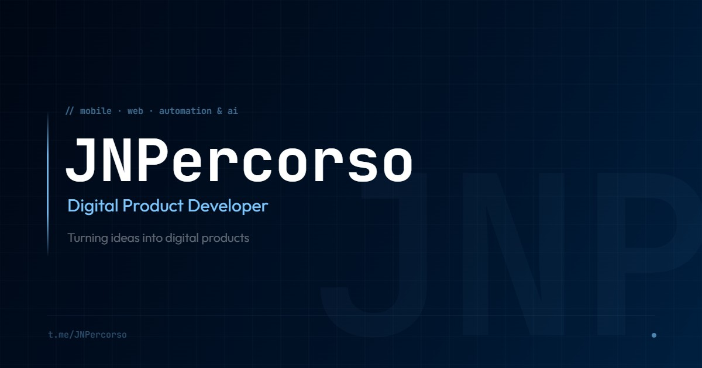

  

<h1 align="center">Andrey Nesterenko</h1>

<b>JNPercorso</b> — Digital Product Developer

  

  I turn ideas into digital products — mobile apps for iOS &amp; Android, websites &amp; landings, automation &amp; AI agents. From concept to release.

---

### 🚀 What I do

- 📱 **Mobile apps** — iOS & Android, App Store & Google Play, full-stack
- 🌐 **Websites & landings** — from a simple landing to a full-featured web product
- 🤖 **Automation & AI agents** — bots, agents, process automation
- 🎯 **Pixel-perfect execution** — precise implementation from design to code

### 🛠️ Tools & stack

  
  
  
  
  
  
  
  
  
  
  
  
  

### 📊 GitHub stats

  
  

### 📫 Contact

  
  
  
  
  

